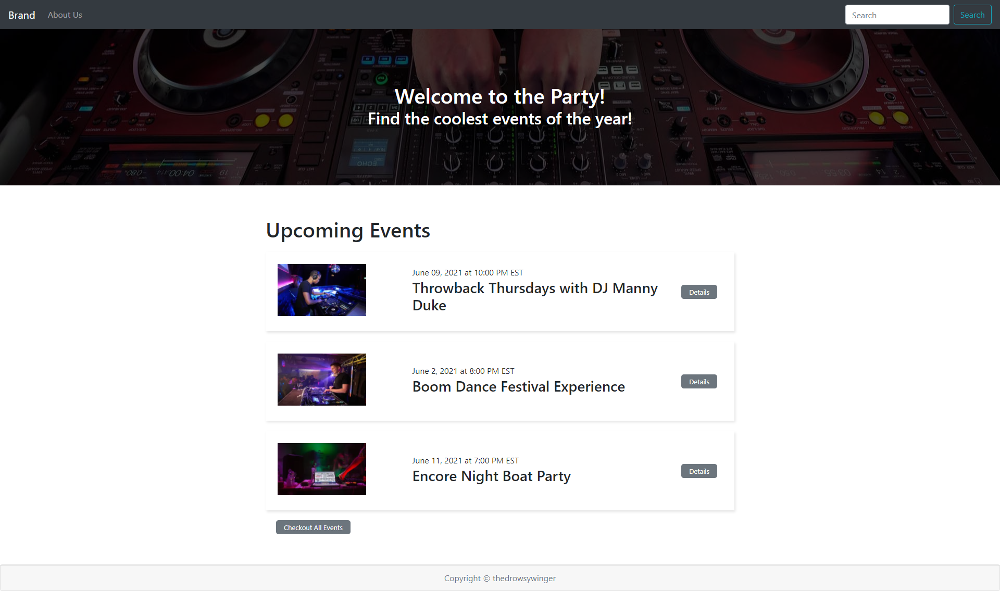
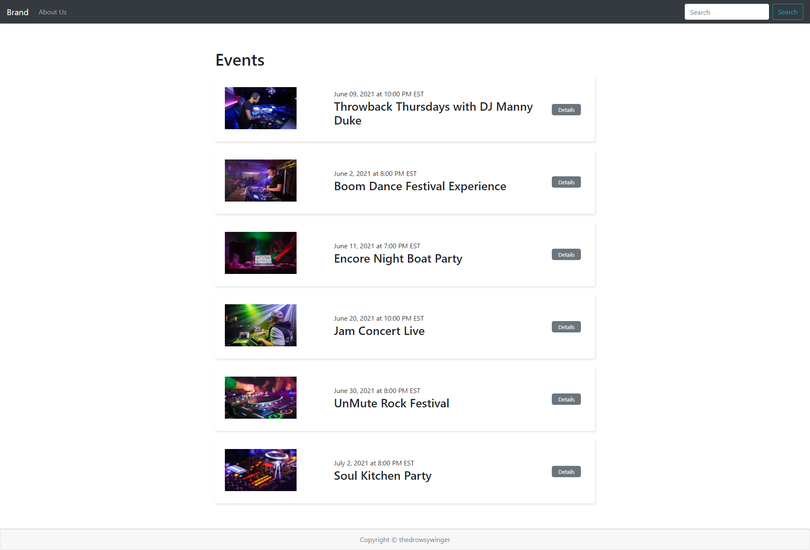
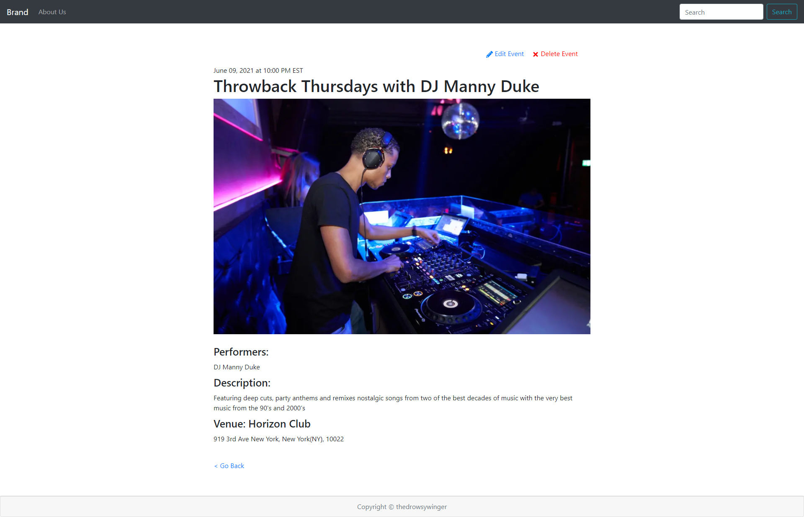
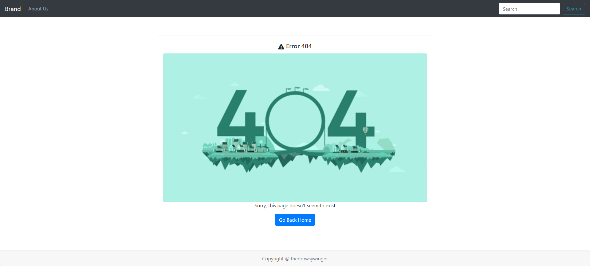
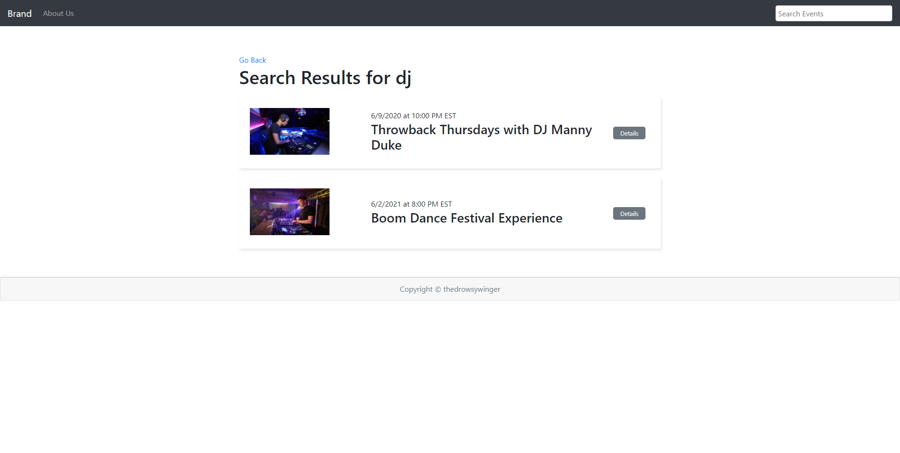
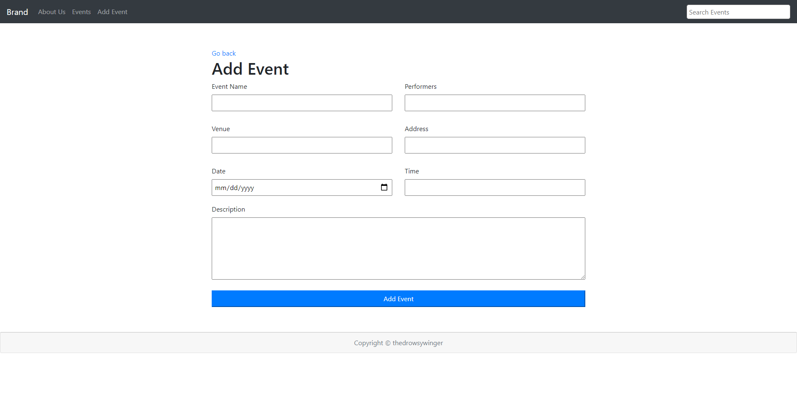
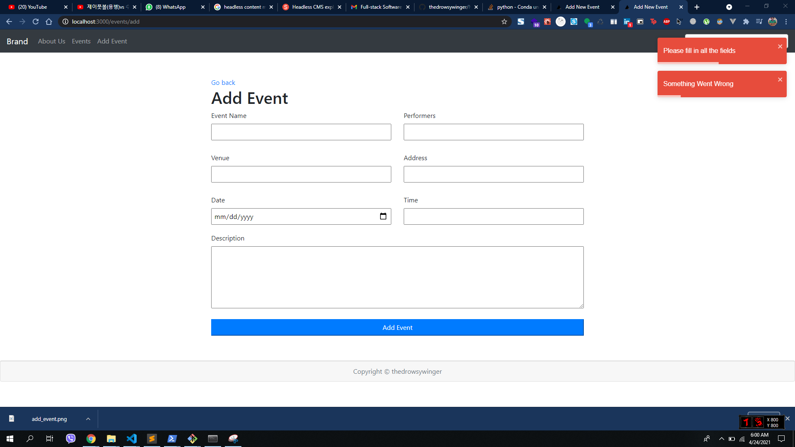
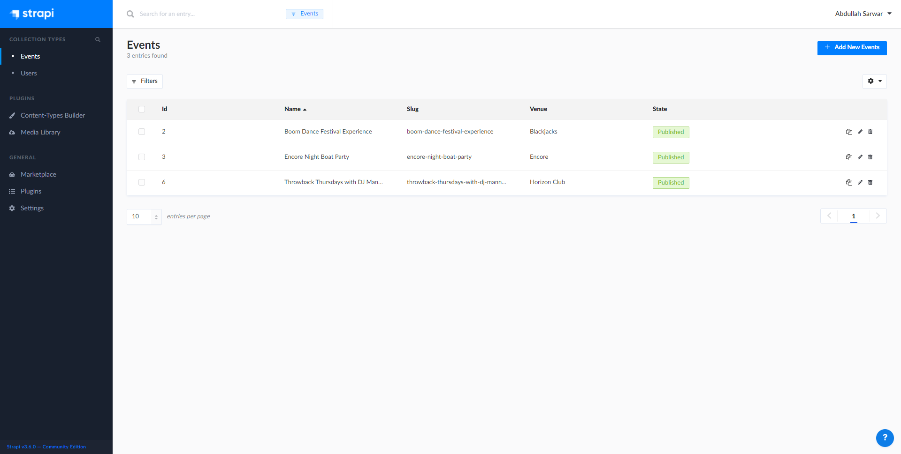

This will be an event showcasing website. 

It is a [Next.js](https://nextjs.org/) project bootstrapped with [`create-next-app`](https://github.com/vercel/next.js/tree/canary/packages/create-next-app) and combined with a [`Strapi`](https://strapi.io/) backend.

I am learning Next Js from a course by [`Traversy media`](https://www.udemy.com/course/nextjs-dev-to-deployment/) 

## Getting Started

FirsThis will be an event showcasing website. 

It is a [Next.js](https://nextjs.org/) project bootstrapped with [`create-next-app`](https://github.com/vercel/next.js/tree/canary/packages/create-next-app) and combined with a [`Strapi`](https://strapi.io/) backend.

I am learning Next Js from a course by [`Traversy media`](https://www.udemy.com/course/nextjs-dev-to-deployment/) 

## Getting Started

First, run the development server:

```bash
cd next-js-event-frontend
npm run dev
# or
yarn dev
```

Open [http://localhost:3000](http://localhost:3000) with your browser to see the result.



#### All Events Page


#### Specific Event Page


#### Custom Error 404 Page


#### Search Filter


#### Add New Event


#### Using React Toastify


#### Using React Toastify
This is all connect to a headless CMS, [Strapi](https://strapi.io/)

